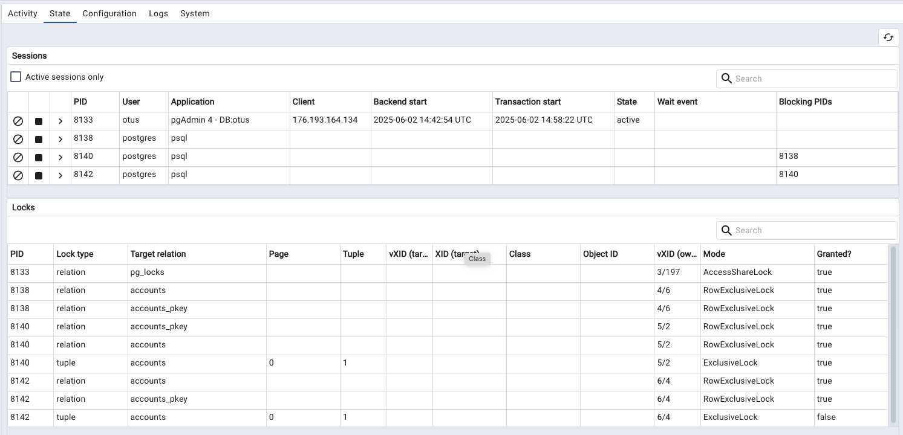

## 4 Блокировки
### Для выполнения используется YC. Для создания в YC ВМ и установки в нем постгреса использовать скрипт `yc-install.sh`. Для подключения к ВМ использовать скрипт `yc-ssh.sh` и далее `sudo -u postgres psql`. После завершения работы - `yc-uninstall.sh`
### Настройте сервер так, чтобы в журнал сообщений сбрасывалась информация о блокировках, удерживаемых более 200 миллисекунд.
- Применить настройки логирования
```
alter system set log_lock_waits = on;
alter system set log_min_duration_statement = 200;
select pg_reload_conf();
```
- Проверить применились ли настройки
```
select name, setting, pending_restart from pg_settings where name in ('log_lock_waits', 'log_min_duration_statement');
            name            | setting | pending_restart 
----------------------------+---------+-----------------
 log_lock_waits             | on      | f
 log_min_duration_statement | 200     | f
(2 rows)
```
### Воспроизведите ситуацию, при которой в журнале появятся такие сообщения.
- 1ая консоль
```
CREATE TABLE accounts(
  acc_no integer PRIMARY KEY,
  amount numeric
);
INSERT INTO accounts VALUES (1,1000.00), (2,2000.00), (3,3000.00);
CREATE TABLE
INSERT 0 3

BEGIN;
SELECT pg_backend_pid();

BEGIN
 pg_backend_pid 
----------------
           6386
(1 row)

otus=*# UPDATE accounts SET amount = amount + 100 WHERE acc_no = 1;
```
- 2ая консоль
```
BEGIN;
SELECT pg_backend_pid();

BEGIN
 pg_backend_pid 
----------------
           6483
(1 row)

CREATE INDEX ON accounts(acc_no);
-- сессия зависла. Команда ждёт блокировку
```
- Проверим журнал
```
yc-user@otus-vm:~$ sudo -u postgres tail -n 10 /var/log/postgresql/postgresql-16-main.log 
2025-06-01 13:10:23.260 UTC [6483] postgres@otus LOG:  process 6483 still waiting for ShareLock on relation 16389 of database 16388 after 1000.161 ms
2025-06-01 13:10:23.260 UTC [6483] postgres@otus DETAIL:  Process holding the lock: 6386. Wait queue: 6483.
2025-06-01 13:10:23.260 UTC [6483] postgres@otus STATEMENT:  CREATE INDEX ON accounts(acc_no);
```

### Смоделируйте ситуацию обновления одной и той же строки тремя командами UPDATE в разных сеансах.
- 1ая консоль
```
BEGIN;
SELECT pg_backend_pid();
UPDATE accounts SET amount = amount + 100.00 WHERE acc_no = 1;
BEGIN
 pg_backend_pid 
----------------
           8138
(1 row)

UPDATE 1
```
- 2ая консоль
```
BEGIN;
SELECT pg_backend_pid();
UPDATE accounts SET amount = amount + 100.00 WHERE acc_no = 1;
BEGIN
 pg_backend_pid 
----------------
           8140
(1 row)
```
- 3я консоль
```
BEGIN;
SELECT pg_backend_pid();
UPDATE accounts SET amount = amount + 100.00 WHERE acc_no = 1;
BEGIN
 pg_backend_pid 
----------------
           8142
(1 row)
```

### Изучите возникшие блокировки в представлении pg_locks и убедитесь, что все они понятны.

### Воспроизведите взаимоблокировку трех транзакций.
- 1ая консоль
```
-- Первая транзакция намерена перенести 100 рублей с первого счета на второй. Для этого она сначала уменьшает первый счет
postgres=# BEGIN;
UPDATE accounts SET amount = amount - 100.00 WHERE acc_no = 1;
BEGIN
UPDATE 1
```
- 2ая консоль
```
-- В это же время вторая транзакция намерена перенести 10 рублей со второго счета на третий. Она начинает с того, что уменьшает второй счет:
postgres=# BEGIN;
UPDATE accounts SET amount = amount - 10.00 WHERE acc_no = 2;
BEGIN
UPDATE 1
```
- 3я консоль
```
-- В это же время третья транзакция намерена перенести 10 рублей со третьего счета на первый. Она начинает с того, что уменьшает третий счет:
postgres=# BEGIN;
UPDATE accounts SET amount = amount - 10.00 WHERE acc_no = 3;
BEGIN
UPDATE 1
```
- 1ая консоль
```
postgres=*# UPDATE accounts SET amount = amount + 100.00 WHERE acc_no = 2;
```
- 2ая консоль
```
postgres=*# UPDATE accounts SET amount = amount + 10.00 WHERE acc_no = 3;
UPDATE 1
```
- 3я консоль
```
postgres=*# UPDATE accounts SET amount = amount + 10.00 WHERE acc_no = 1;
ERROR:  deadlock detected
DETAIL:  Process 6595 waits for ShareLock on transaction 746; blocked by process 6266.
Process 6266 waits for ShareLock on transaction 747; blocked by process 6410.
Process 6410 waits for ShareLock on transaction 748; blocked by process 6595.
HINT:  See server log for query details.
CONTEXT:  while updating tuple (0,1) in relation "accounts"
```