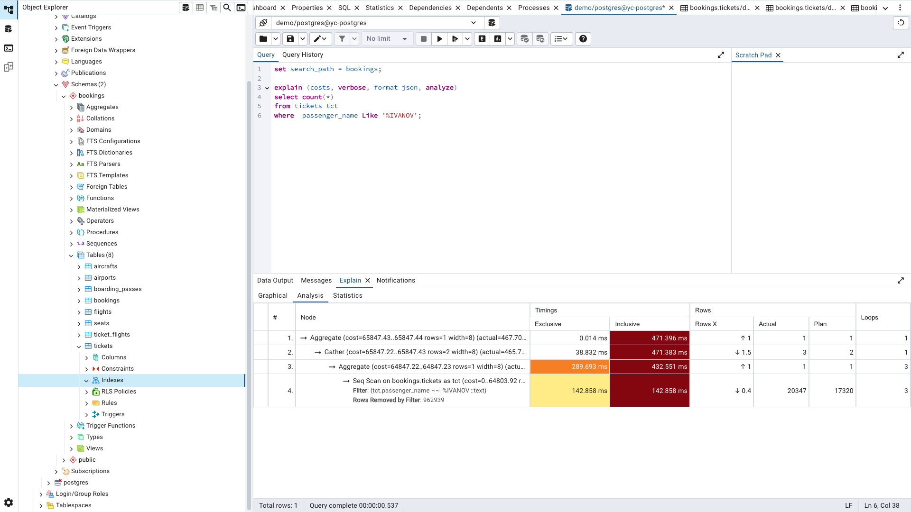
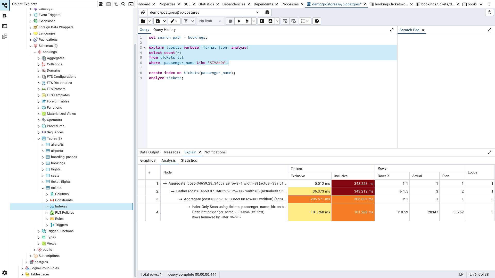
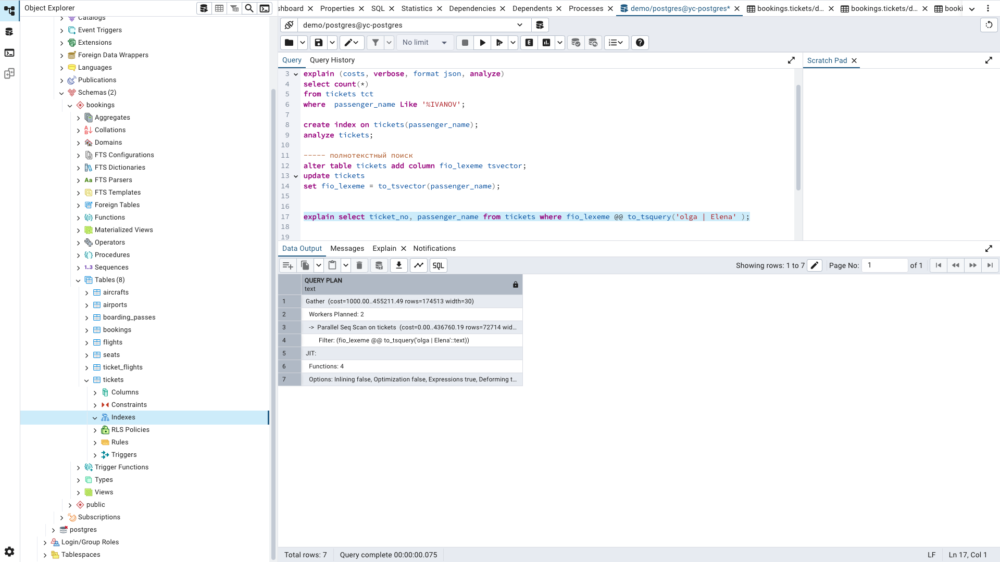
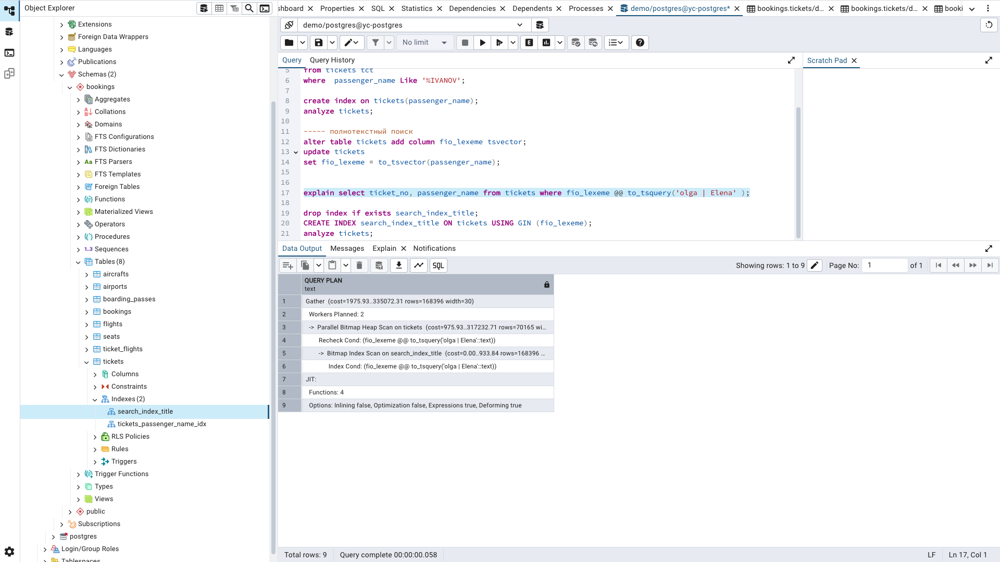

##  6 Работа и индексами
### Подготовка
- Установить ВМ с Постгрес YC
```shell
./yc-install.sh
```
- Подключиться к ВМ с установленным постгресом
```shell
./yc-ssh.sh
```

- Установить демонстрационную БД
```shell
sudo apt install unzip
wget --quiet https://edu.postgrespro.ru/demo_big.zip
unzip demo_big.zip
sudo -u postgres psql < demo_big.sql
sudo -u postgres psql -d demo
```
```
demo=# set search_path = bookings;
SET
demo=# \dt
               List of relations
  Schema  |      Name       | Type  |  Owner   
----------+-----------------+-------+----------
 bookings | aircrafts       | table | postgres
 bookings | airports        | table | postgres
 bookings | boarding_passes | table | postgres
 bookings | bookings        | table | postgres
 bookings | flights         | table | postgres
 bookings | seats           | table | postgres
 bookings | ticket_flights  | table | postgres
 bookings | tickets         | table | postgres
(8 rows)
```

### Основная часть
 - Написать запрос (получение количества билетов пассажиров c фамилией Иванов) поиска данных без индексов, посмотреть их план запросов. 
 
 - Добавить на таблицы индексы с целью оптимизации запросов поиска данных. 
Создадим btree-индекс на поле tickets.passenger_name, т.к. это поле используется для фильтрации в нашем запросе.
 - Сравнить новыЙ план запроса с предыдущим.
   
   | План выполнения запроса без индекса                     | План выполннения запроса с индексом                    |
   |:--------------------------------------------------------|:-------------------------------------------------------|
   |  |  |

 - Рассмотреть применение GIN-индекса для полнотекстового поиска.

   | План выполнения запроса без индекса                     | План выполннения запроса с индексом                    |
   |:--------------------------------------------------------|:-------------------------------------------------------|
   |  |  |


 - Удалить ВМ из YC
```shell
./yc-uninstall.sh
```

